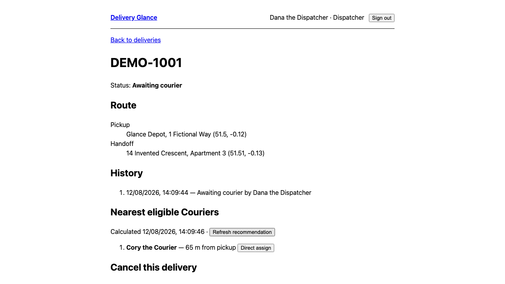
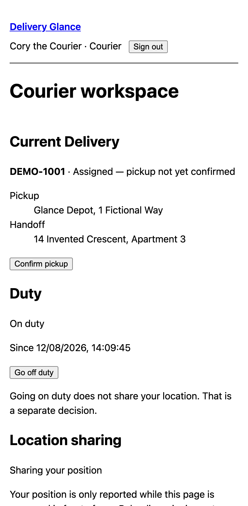
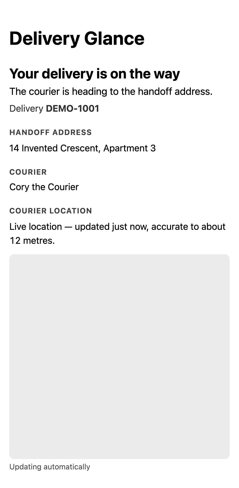
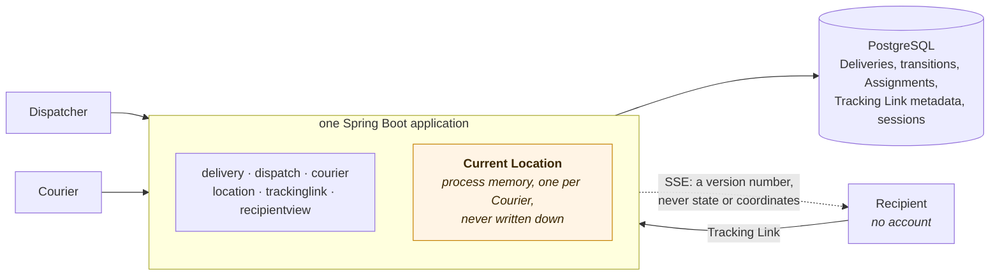

# Delivery Glance

**A recipient-first last-mile delivery tracker.** A Dispatcher creates a Delivery and atomically
assigns a nearby available Courier; the Courier shares only a foreground current location and
confirms pickup and handoff; a Recipient with no account follows the whole thing through a secure,
expiring Tracking Link that updates itself.

The interesting part is not that it tracks a delivery. It is what it refuses to do: keep a location
history, tell a Recipient more than their own Delivery, let two Dispatchers assign the same Courier,
or claim to know where somebody is on the strength of a two-minute-old reading.

| | |
|---|---|
| **Live demo** | _(release input — the owner's HTTPS deployment; see [`docs/deployment.md`](docs/deployment.md))_ |
| **Stack** | Java 25 · Spring Boot 4.1 · PostgreSQL 18 · React 19 · TypeScript · MapLibre · Docker |
| **Status** | Portfolio Core, complete. Everything below is built and tested; [Future Work 13–19](docs/planning/map.md#future-work) is designed and deliberately not built. |

---

## What it looks like

| Dispatcher · desktop | Courier · phone | Recipient · phone, no account |
|---|---|---|
| [](docs/screenshots/dispatcher-delivery-detail.png) | [](docs/screenshots/courier-workspace.png) | [](docs/screenshots/recipient-tracking.png) |
| The recommendation is a **distance**. The Courier's coordinates never reach this page. | On Duty and Location Sharing are two separate decisions, and the page says so. | The map is grey because these are taken with an empty map style — a deployment with a tile provider draws real tiles here. |

All three are produced by driving the running application, not taken by hand:

```bash
npm --prefix web run screenshots
```

## Run it

You need Docker. Nothing else.

```bash
git clone https://github.com/Jamiedz999/delivery-glance.git
cd delivery-glance
docker compose up --build --wait
```

Then open <http://localhost:8080> and sign in.

| Role | Email | Password |
|---|---|---|
| Dispatcher | `dispatcher@delivery-glance.example` | `Dispatcher-Demo-2026!` |
| Courier | `courier@delivery-glance.example` | `Courier-Demo-2026!` |

Two fictional accounts, seeded by the first Flyway migration. There is no registration, invitation or
password reset; these are the only two. Sign in as each in **two different browser profiles** — one
browser holds one session, and this is two people. Each account reaches only its own workspace: the
Dispatcher API refuses a Courier session with `403` and the reverse holds too, even when the route is
requested directly.

**[`docs/demo-script.md`](docs/demo-script.md) is the six-minute walkthrough** — three roles, in
order, with what to say at each step. Follow that rather than clicking around; the product's point is
in the sequence.

To reset: `docker compose down -v` removes the database volume.

<details>
<summary>Developing on it, rather than running it</summary>

```bash
docker compose up postgres --wait      # PostgreSQL only
(cd server && ./mvnw spring-boot:run)  # backend on :8080
npm --prefix web install
npm --prefix web run dev               # Vite on :5173, proxying /api and /actuator
```

The Recipient page is the exception: `/track` is generated by the backend and loads a build artefact
rather than something Vite serves, so follow a Tracking Link against the Compose run above.

</details>

## How it is built

One Spring Boot application, one PostgreSQL database, and the compiled React assets inside the same
jar so everything a browser loads comes from one origin.



Three choices carry most of the design, and each is a trade rather than a default:

- **PostgreSQL decides the race.** Two Dispatchers can assign the same Courier at the same instant,
  and an application-level eligibility check loses that race by construction — both readers see a
  free Courier. Two partial unique indexes settle it: one caller gets `204`, the other `409`.
  [`AssignmentConcurrencyTest`](server/src/test/java/com/deliveryglance/dispatch/AssignmentConcurrencyTest.java)
  proves it against a real PostgreSQL container, released from a latch, three times per run.

- **Current Location lives in process memory, and nowhere else.** The cheapest way to keep a
  promise never to build a route history is to have nowhere to break it. One map, at most one
  snapshot per Courier, never appended to; a read past two minutes deletes the snapshot rather than
  hiding it. The visible consequence is deliberate: restart the app and the Courier is still On Duty
  — that is durable — but their location is Unavailable until they report again.

- **SSE carries a refresh hint, not the truth.** What comes down the stream is a version number
  saying "read again". Every fact on the Recipient's screen still arrives through the same authorised
  snapshot read the page does on load, so a reconnect needs no replay, and a bug in the stream cannot
  leak anything because the stream carries nothing to leak.

**[`docs/architecture.md`](docs/architecture.md)** has the full system diagram, the end-to-end
sequence diagram, and why Redis, Kafka, PostGIS, WebFlux and a full Matching Round are Future Work
rather than missing dependencies.

## Privacy, and what is never stored

This is the part the product is actually about.

| Promise | How it is kept |
|---|---|
| No route history | Raw coordinates exist only in one in-memory snapshot per Courier. `LocationPrivacyTest` inspects **every column in the schema** and finds nowhere one could be written. |
| No coordinate in a log | Asserted against the captured application log after a real report. |
| Location Sharing is explicit and foreground-only | Going On Duty asks the browser for nothing. Reporting happens only while the page is visible, and pauses honestly rather than pretending to continue. Stop, sign-out or reload ends it — the reporting secret lives only in the page that started the session. |
| The Dispatcher sees distance, not position | Derived server-side; the coordinate never leaves the `location` module. |
| A Tracking Link is a capability, not an account | 256 bits, HMAC-derived, carried in the URL **fragment** so RFC 3986 keeps it out of every request. Only a SHA-256 verifier is stored, so a database copy cannot be turned back into a working link. The page exchanges it for a short-lived cookie and removes it from the address bar and from history before rendering anything. |
| A bad link says nothing | Tampered, unknown and expired links get one identical response — which is what stops the route becoming a way to ask whether a Delivery exists. |
| A Recipient sees one Delivery, reduced | No Pickup Address, no internal identifier, no cancellation reason. No map before pickup, because a Courier heading to a pickup would put the Pickup Address on screen by inference. Delivered removes the Courier's name and every trace of location. |
| A grant confers nothing else | A Tracking grant reaches no internal route, and an Internal Account session reaches no Recipient route. |

Both checks below are committed commands, not assertions about them:

```bash
scripts/scan-repository.sh                          # this repository
scripts/check-deployment.sh https://your-host       # a running deployment
```

The repository scan searches every blob across every ref for private keys, cloud tokens, raw Tracking
tokens and reporting secrets, and checks the working tree for addresses that do not read as invented
and coordinates outside the one fictional area. It also asserts the *inverse* — that the only
credentials present are the four documented development values — so a fifth one joining them fails
the run. **Result at the current revision: all checks pass.**

The address and coordinate halves read the working tree only, and that limit is deliberate rather
than an oversight: git history cannot be rewritten without invalidating every merged pull request.
It matters here, because this is a limit with a known instance — the UI prototypes under
`docs/planning/prototypes/` carried real street addresses and coordinates as sample data until they
were replaced, and those earlier revisions are still in any clone. Nothing about them was ever
anybody's delivery, and no credential was involved; saying so is better than a scan that quietly
implies otherwise.

The four development credentials that are in this repository on purpose are the two demo passwords
above, `development-only-tracking-key-do-not-deploy`, and the local Compose database password. All
of them are documented as development values, and
[`docs/deployment.md`](docs/deployment.md#3--real-tracking-link-key-material) says what to replace
them with.

## What it proves about itself

**[`docs/testing.md`](docs/testing.md) is the risk matrix**: every claim this project makes, the
command that proves it, and — beside each one — the limits it deliberately does not claim. Two rules
hold throughout it, and throughout this README:

> **No number appears that a committed command did not produce.** There is no coverage percentage, no
> throughput figure and no latency figure, because nothing in this repository measures one.
>
> **Each row names the risk, not the feature.** "Assignment works" is not a risk. "Two Dispatchers
> assign the same Courier at the same moment and both succeed" is.

Everything CI runs on every push, from a clean checkout:

```bash
# The repository itself: credentials and tokens across every blob on every ref
scripts/scan-repository.sh

# Backend: unit, module and real-PostgreSQL integration tests (Testcontainers)
(cd server && ./mvnw verify)

# Frontend: formatting, linting, type checking, component tests, production build
npm --prefix web ci
npm --prefix web run format:check
npm --prefix web run lint
npm --prefix web run check

# The production-like target, configured with the map style the journeys serve
npx --prefix web playwright install --with-deps chromium
TRACKING_MAP_STYLE_URL=http://127.0.0.1:9099/style.json docker compose up --build --wait
curl --fail --silent http://localhost:8080/actuator/health
curl --fail --silent http://localhost:8080/api/system

# The headers, refusals and cookies of whatever is running at that URL
scripts/check-deployment.sh http://localhost:8080

# Two cross-role journeys plus the accessibility checks
npm --prefix web run e2e
docker compose down
```

The two journeys are the portfolio claim rendered as tests. **Happy path**: all three people, the
Recipient's phone opened once and never reloaded, so every change it shows arrived on its own.
**Degradation**: sharing stops, the application restarts underneath a live stream, and the reading
ages Live → Delayed → Unavailable *on the phone's own clock* — the marker leaves the map while the
page still says it is reconnecting. No retries, in CI or locally: a suite that passes on the second
attempt is evidence of nothing.

## Trade-offs, and what is deliberately absent

| Chosen | Given up | Why that way round |
|---|---|---|
| foreground-only Location Sharing | reporting while backgrounded | the page can only promise what a browser will actually do |
| one reusable seven-day Tracking Link | Rotation, Revocation, Reissue | recovery needs a reason catalog, a history UI and a retention rule; Core ships the properties that make a public bearer link safe at all |
| Direct Assignment | invitations, Decline, Timeout, cooldown | keeps the concurrency invariant, drops the timers |
| Current Location in memory only | any durable position | nothing to leak, and no migration that could turn it into a trail |
| the Recipient's own timer for freshness | trusting the server to say | a disconnected page still tells the truth |
| no ETA | travel-time estimates | an ETA needs a routing provider and an honest unavailable state; an invented one is worse than none |

**Redis, Kafka, PostGIS, WebFlux and a sixty-second Matching Round are not missing — they have no job
here.** Each has a written trigger and a designed increment waiting behind it, and adding one before
its trigger fires would make this application harder to run and no better.
[`docs/architecture.md`](docs/architecture.md#why-redis-kafka-postgis-webflux-and-full-matching-are-not-here)
sets out each trigger.

### Known limits

Real, and listed rather than discovered:

- **One instance.** Current Location and SSE subscribers are per-process. Two would need
  [Future Work 18](docs/planning/future-work/18-run-measured-scale-and-resilience-experiment.md).
- **No Reassignment, Courier Withdrawal, Dispatcher Revocation or Undeliverable outcome.** A Delivery
  in trouble after pickup has no modelled way out.
  [Future Work 15](docs/planning/future-work/15-add-delivery-exceptions-and-reassignment.md).
- **The Dispatcher has no button to copy a Tracking Link.** The endpoint exists and is tested; the
  control does not.
- **A Courier watching their own workspace is not told they have been assigned** until they reload.
- **Recipient-facing times render in the reader's own time zone**, not the Handoff Address's.
- **One browser engine**, Chromium, at a desktop and a phone viewport.
- **Accessibility is checked, not certified**: automated axe-core rules with no serious or critical
  violations, plus a documented keyboard walkthrough. No screen-reader session, no WCAG audit.
- **No performance, latency or scale figure exists**, anywhere, for the reason stated above.

The three above that are defects rather than scope decisions — the missing Copy button, the Courier
workspace not noticing an Assignment, and the time zone — are written up with several more in
[`docs/planning/implementation/INCIDENTAL-FINDINGS.md`](docs/planning/implementation/INCIDENTAL-FINDINGS.md),
each with how it was found and why it was not fixed on the spot. The rest are limits of what Core
set out to build, and [`docs/testing.md`](docs/testing.md) is where those are stated.

## Deploying it

[`docs/deployment.md`](docs/deployment.md) is a provider-agnostic runbook: one image, one PostgreSQL,
TLS in front, real Tracking Link key material, an optional restricted map style, and
`scripts/check-deployment.sh` to prove the result. It deliberately names no hosting provider — there
is nothing here that constrains the choice.

## How this repository is organised

The repository says **why** the work is shaped this way; GitHub says **what** to build and how far
along it is.

| Where | What |
|---|---|
| [`CONTEXT.md`](CONTEXT.md) | the domain glossary — the vocabulary everything else is written in |
| [`docs/architecture.md`](docs/architecture.md) | diagrams, the three choices, the trade-offs, the limits |
| [`docs/testing.md`](docs/testing.md) | the risk matrix: every claim, its command, and what it does not claim |
| [`docs/deployment.md`](docs/deployment.md) · [`docs/demo-script.md`](docs/demo-script.md) | running it somewhere, and showing it to somebody |
| [`docs/adr/`](docs/adr) | resolved product and architecture decisions, each with a callout naming what Core actually implements |
| [`docs/planning/`](docs/planning) | the Sprint roadmap, research, prototypes and [Future Work 13–19](docs/planning/map.md#future-work) |
| [GitHub Issues](https://github.com/Jamiedz999/delivery-glance/issues) | the implementation queue. Each Issue is its own full specification; nothing here duplicates one |

Four one-week Sprints, about 38–46 focused hours: a walking skeleton, a dispatchable Delivery, the
Recipient MVP, and then the evidence and presentation that make it a finished thing rather than a
work in progress. [`docs/planning/12-rescope-to-resume-ready-core.md`](docs/planning/12-rescope-to-resume-ready-core.md)
is where that was decided, and why.
