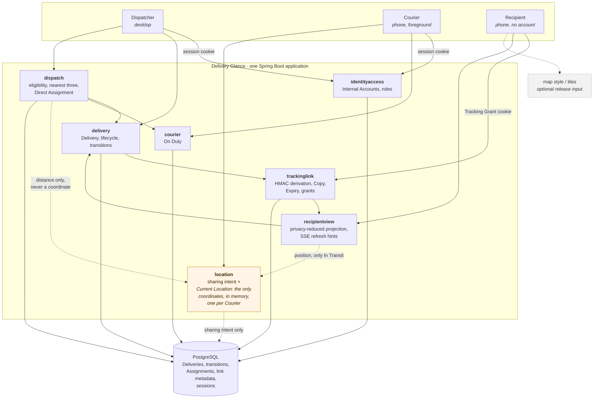
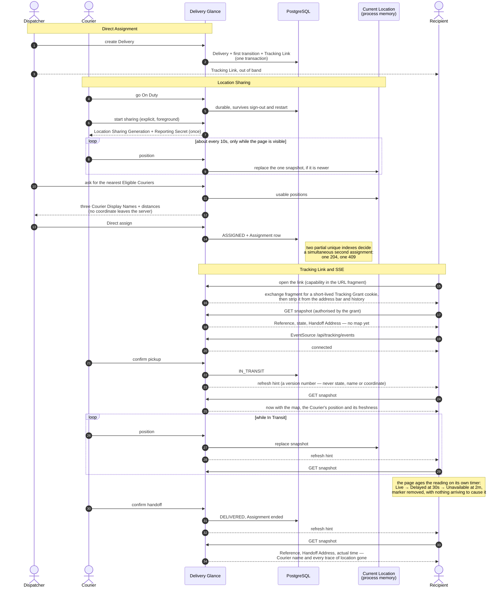

# How Delivery Glance is built, and why

Status: current

This file answers two questions a reader of the repository should not have to reconstruct from the
source: what the pieces are, and why there are so few of them. The vocabulary is
[`CONTEXT.md`](../CONTEXT.md)'s; what the tests prove about any of it is
[`docs/testing.md`](testing.md); what Core deliberately does not build is
[Future Work 13–19](planning/map.md#future-work).

## The shape of it

One Spring Boot application, one PostgreSQL database, and the compiled React assets inside the same
jar so that everything a browser loads comes from one origin.



The dotted edges are the ones worth reading twice.

- `location` writes only *sharing intent* to PostgreSQL — which session is allowed to report, and the
  digest of its Reporting Secret. The coordinates never go there. They live in one in-memory map, at
  most one snapshot per Courier, and a restart makes them Unavailable until a fresh report arrives.
- `dispatch` asks `location` for a position and turns it into a distance before anybody sees it. The
  Dispatcher's recommendation shows "1.2 km away", never a latitude.
- `recipientview` asks for a position only while the Delivery is In Transit. A Courier heading to a
  pickup is not information about this Delivery's journey, and showing it would put the Pickup
  Address on screen by inference.

## One Delivery, end to end

The path the whole product is about: a Dispatcher assigns, a Courier shares, and a Recipient who has
no account watches it happen.



Two properties of that diagram carry most of the design.

**The stream is a saving on polling, not a second source of truth.** Every fact on the Recipient's
screen arrives through the same authorised snapshot read the page does on load. What comes down the
`EventSource` is a version number saying "read again". So a reconnect needs no replay: the page
fetches the current snapshot and the changes it slept through are simply part of that answer. It also
means a bug in the stream cannot leak anything, because the stream carries nothing to leak.

**The page is honest while disconnected.** Location Freshness is computed by the browser from the
reading's own timestamp, so a page that has lost its connection still reaches `Unavailable` at two
minutes and removes the marker. It says it is reconnecting, and separately says it does not know
where the Courier is. Those are two different questions and the page answers both.

## Why these three choices

### PostgreSQL for everything durable

Delivery Glance's hardest correctness problem is that two Dispatchers can assign the same Courier at
the same instant. The application checks eligibility, but an application check loses that race by
construction — both readers see a free Courier. What settles it is two partial unique indexes:

```sql
CREATE UNIQUE INDEX assignment_one_active_delivery_idx ON assignment (delivery_id) WHERE ended_at IS NULL;
CREATE UNIQUE INDEX assignment_one_active_courier_idx  ON assignment (courier_account_id) WHERE ended_at IS NULL;
```

The second writer gets a constraint violation and a `409`. That is the property
`AssignmentConcurrencyTest` exists to prove, against a real PostgreSQL container, from a latch.

Everything else durable follows from wanting one transaction around it: a Delivery and the transition
explaining it are written together, and so is its Tracking Link, so no Delivery can exist without its
history or without being trackable. Flyway owns every table, including Spring Session's; there is no
runtime DDL and no JPA, so what the schema is, is what the migrations say.

### Current Location in process memory

This is the choice that looks like a shortcut and is not.

The product promises there is no Route History — no durable trail of where a Courier has been. The
cheapest way to keep a promise like that is to have nowhere to break it. There is one
`ConcurrentHashMap` holding at most one complete snapshot per Courier; it never appends; and a read
past the two-minute limit deletes the snapshot rather than hiding it. Raw coordinates never reach
PostgreSQL, logs, metrics or any audit table.

The visible consequence is deliberate: restart the application and the Courier is still On Duty —
that is durable — but their location is `Unavailable` until they report again. A user could read that
as a bug. It is the design, and the README and the demo both point at it on purpose.

The cost is that this only works for one instance. Two application instances would each hold their
own snapshots and disagree. Core is one instance, so that cost is not paid; see Redis below.

### Server-Sent Events for the Recipient view

The Recipient's page needs to change without being reloaded. SSE gives that over plain HTTP, on the
same origin, with the browser's own reconnect, in one `SseEmitter` per subscriber — and it is
one-directional, which is the exact shape of the need. A Recipient sends nothing.

WebSocket would buy a return channel nothing uses, and cost a second protocol to secure, proxy and
test. Polling would work but would either be slow or wasteful.

SSE is used *only* for the Recipient view. The Dispatcher and Courier pages refetch after their own
commands. A three-role realtime fan-out is a bigger thing than this product needs, and building it
would have meant the Recipient's live view arrived later.

## Why Redis, Kafka, PostGIS, WebFlux and full Matching are not here

The distinction that matters: these are not missing dependencies. They are dependencies with no job.
A portfolio project that lists Redis on the strength of a cache nobody measured is describing a
résumé, not a system. Each of them has a written trigger, and until the trigger fires, adding it
would make this application harder to run and no better.

| Not in Core | What it would do here | What has to be true first | Where it is designed |
|---|---|---|---|
| **Redis** | share Current Location and SSE fan-out across instances | more than one application instance, which means a measured reason to run more than one | [Future Work 18](planning/future-work/18-run-measured-scale-and-resilience-experiment.md) |
| **Kafka** | durable domain-event log with replay | a second consumer of non-location events that actually benefits from replay, plus an outbox. Raw Courier coordinates never belong in it | [Future Work 19](planning/future-work/19-evaluate-durable-domain-event-backbone.md) |
| **PostGIS** | spatial indexing and Service Zone polygons | evidence that in-memory Haversine over a handful of on-duty Couriers is a bottleneck, or a product need for zone polygons | [Future Work 16](planning/future-work/16-add-service-zones-and-explainable-overrides.md), [18](planning/future-work/18-run-measured-scale-and-resilience-experiment.md) |
| **WebFlux** | non-blocking IO for many idle connections | a measured connection count that Servlet threads cannot hold. Spring MVC's `SseEmitter` is already asynchronous | [Future Work 18](planning/future-work/18-run-measured-scale-and-resilience-experiment.md) |
| **Full Matching Round** | sixty-second rounds, invitations, Interest, Decline, Timeout, cooldown, ranking at close | a Courier population where offering work beats assigning it. With one Courier it is timers with nobody to wait for | [Future Work 17](planning/future-work/17-add-ranked-multi-courier-matching-round.md) |

Core keeps the part of the matching story that is actually hard — the race, and the database that
settles it — and leaves the part that is mostly timers.

## The trade-offs Core made on purpose

| Chosen | Given up | Why that was the right way round |
|---|---|---|
| foreground-only Location Sharing | reporting while the app is backgrounded | the page can only promise what a browser will actually do. Reporting pauses honestly instead of pretending to continue |
| one reusable seven-day Tracking Link | Rotation, Revocation, Reissue | a link that can be recovered needs a reason catalog, a history UI and a retention rule. Core ships the properties that make a public bearer link safe at all: high entropy, HMAC derivation with only a verifier stored, fragment-to-cookie exchange, one generic refusal, no raw token in any log |
| Direct Assignment | invitations and Decline | keeps the concurrency invariant and drops the timers |
| Current Location in memory only | any durable position | there is nothing to leak, and no migration that could turn it into a trail |
| the Recipient's own timer for freshness | trusting the server to say | a disconnected page still tells the truth |
| no ETA | travel-time estimates | an ETA needs a routing provider and an honest unavailable state. An invented one is worse than none |

## Known limits

These are real, they are not defects of the implementation, and they are listed here rather than
discovered:

- **One instance.** Current Location and SSE subscribers are per-process. Running two would need
  Future Work 18 first.
- **No Reassignment, Courier Withdrawal, Dispatcher Revocation or Undeliverable outcome.** A Delivery
  in trouble after pickup has no modelled way out. Future Work 15.
- **Recipient-facing times render in the reader's own time zone**, not the Handoff Address's, which is
  what `CONTEXT.md` specifies. Closing it needs a coordinate-to-time-zone dataset; recorded in
  [`INCIDENTAL-FINDINGS.md`](planning/implementation/INCIDENTAL-FINDINGS.md).
- **The Dispatcher has no button to copy a Tracking Link.** The endpoint exists and is tested; the
  control does not. Also in `INCIDENTAL-FINDINGS.md`.
- **A Courier watching their own workspace is not told they have been assigned** until they reload.
  Same file.
- **No load, latency or throughput figure exists**, because nothing in this repository measures one.
  `docs/testing.md` says so at every point where a number would otherwise be tempting.
